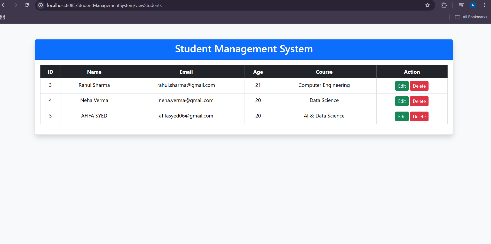
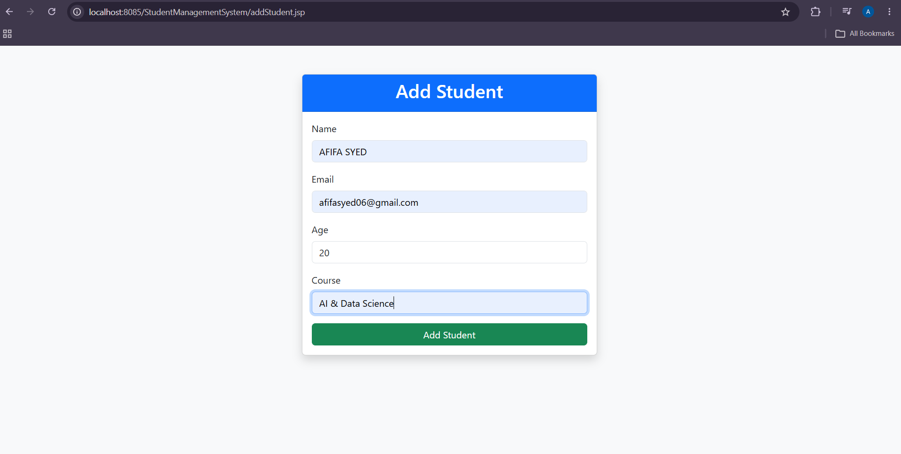
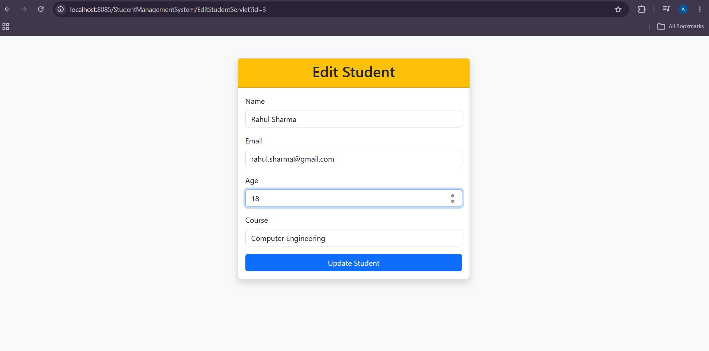

# Student Management System

A Java-based web application that performs CRUD operations for managing student records.

## Features

- Add new students
- View all students
- Update student details
- Delete student records

## Technologies Used

- Java
- Servlet
- JSP
- JDBC
- MySQL
- Apache Tomcat
- Bootstrap
- Maven

## Project Architecture

The project follows MVC architecture.

### Model
Student Java class represents student data.

### View
JSP pages are used to create the user interface.

### Controller
Servlets handle HTTP requests and responses.

### DAO
StudentDAO handles database operations using JDBC.

## Database Operations

Implemented using:
- PreparedStatement
- CRUD SQL queries
- MySQL database connection

## Screenshots

(Add screenshots later)## Screenshots

### Student List

### Add Student

### Edit Student

